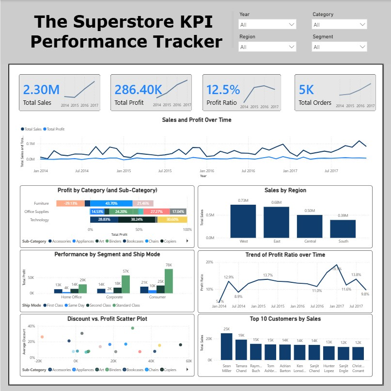

# Superstore Sales Performance Dashboard

## 📊 Project Overview
This project is a comprehensive **Sales Performance Dashboard** built using **Power BI** for the Superstore dataset. The dashboard provides key insights into sales performance, profitability, and customer behavior, enabling data-driven decision-making.

## 🖼️ Dashboard Preview

## 📁 Files Included
| File | Description |
|------|-------------|
| `Superstone PB.pbix` | Power BI dashboard file |
| `Superstore sales dataset.xlsx` | Raw sales data |
| `Preview.jpg` | Dashboard screenshot preview |
| `README.md` | Project documentation |
| `Report.md` | Detailed analysis report |

## 📈 Key Insights

### Overall Performance
| Metric | Value |
|--------|-------|
| **Total Sales** | $2.3M+ |
| **Total Profit** | $286K+ |
| **Total Orders** | 9,994 |

### Top Performing Categories
- **Technology** leads in both sales and profit margins
- **Office Supplies** show consistent but moderate performance
- **Furniture** has the highest number of returns

### Regional Highlights
| Region | Sales Contribution |
|--------|-------------------|
| West | 33% |
| East | 29% |
| South | 22% |
| Central | 16% |

> **Note:** Central Region shows the lowest profit margins

### Monthly Trends
- **November & December** show peak sales (holiday season effect)
- **February** typically experiences the lowest sales

### Product Sub-Categories
| Top Revenue Generators | Low Profitability |
|------------------------|-------------------|
| Phones | Tables |
| Chairs | Bookcases |
| Storage | - |

## 🛠️ How to Use
1. Open `Superstone PB.pbix` in Power BI Desktop
2. Ensure data source connections are configured correctly
3. Use slicers to filter by:
   - Region
   - Category
   - Segment
   - Date
4. Hover over visualizations for detailed tooltips

## 📝 Requirements
- Power BI Desktop (latest version recommended)
- Microsoft Excel (for viewing raw data)

## 🔍 Future Enhancements
- [ ] Add predictive analytics for sales forecasting
- [ ] Integrate customer segmentation analysis
- [ ] Include return rate analysis by product category
- [ ] Implement drill-through functionality

---

*This dashboard was created as part of a data analysis project to demonstrate Power BI capabilities for retail sales analysis.*